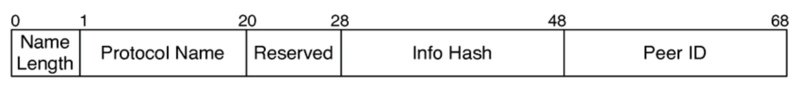

# Bit Torrent
This is a recreation of BitTorrent version 1.0, a project intended for personal learning.
The goal of this project is to help me learn more about distributed systems and 
and other infrastructure programming in C++ like networking and concurrency. 

I followed this [wiki](https://wiki.theory.org/BitTorrentSpecification) as project spec.

Handshake Protocol Format

# Scope
This is the version 1.0 of the BitTorrent protocol specification which includes:
- Bencoding
- Torrent file structure
- Peer wire protocol
- Tracker HTTP/HTTPS protocol

# Project Requirements
- C++ 20
- Cmake

# How to build the app
- mkdir build
- cd build
- cmake ..
- make -j 8

# How to run
- TODO

# Demo
- TODO
